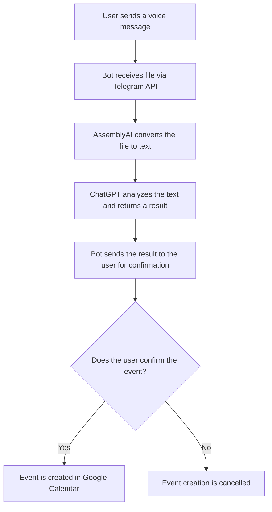

# Telegram bot Calendar

## Description

Telegram bot for managing Google Calendar through Telegram. The bot allows:

- **Event creation** via text and voice messages with automatic natural language recognition
- **Event search** in the calendar by keywords and time intervals
- **Event analytics** with count and total duration calculation
- **Personalization** through keyword system and calendar selection
- **OAuth authorization** for Google Calendar with secure token storage
- **Data caching** for performance optimization

### Key Features:

- Voice command recognition in multiple languages (via AssemblyAI)
- Intelligent text analysis (via OpenAI API)
- Automatic extraction of dates, times, and descriptions from natural language
- Keyword system (regular, compound, default)
- Automatic OAuth token refresh
- User data and session caching

---

## 2. Commands And Features

### Main Commands

- `/start` - Start working with the bot, configure Google Calendar authorization
- `/help` - Get help on using the bot
- `/setting` - Open settings (authorization, calendar, keywords)
- `/analytics` - Request event analytics
- `/search` - Search events in calendar

### Event Creation

#### Text Format:
```
31.01.2024 12:00 Meeting with team
```

Format: `dd.MM.yyyy HH:mm Description`

#### Voice Format:
You can send voice messages in free form, for example:
- "Meeting tomorrow at 14:00 for one hour"
- "Add event the day after tomorrow in the evening at 7 o'clock, duration 2 hours, meeting with client"
- "Tomorrow morning at 10:30 meeting with team for one and a half hours"

**Features:**
- Date can be specified in free form: "tomorrow", "the day after tomorrow", "in a week", etc.
- Time can be specified in words: "at eight", "at ten in the evening", "at 19:00"
- Duration can be specified in words: "for one hour", "for two hours", "from eight to ten"

### Event Search

#### Text Format:
```
2024-01-01 / 2024-01-31 / all / Meeting
```

Format: `yyyy-MM-dd / yyyy-MM-dd / [first|last|all] / [Keyword]`

Parameters:
- First date - start of period
- Second date - end of period  
- Search type: `first` (first), `last` (last), `all` (all)
- Keyword (optional)

#### Voice Format:
You can send voice messages in free form, for example:
- "Find all meetings in January"
- "Find the first event with keyword 'meeting' from last month"

### Analytics

#### Text Format:
```
2024-01-01 2024-01-31 Meeting
```

Format: `yyyy-MM-dd yyyy-MM-dd [Keyword]`

The bot will return:
- Number of events
- Total duration in hours

#### Voice Format:
You can send voice messages in free form, for example:
- "Show analytics for last month"
- "How much time did I spend on meetings in January"

### Settings

Available settings (via `/setting`):

1. **Connection settings** - Google Calendar authorization setup
   - OAuth authorization link
   - Calendar selection from available list

2. **Keywords** - Keyword configuration
   - Keywords are added to the beginning of event description
   - Example: with keyword "Mike", event "tomorrow at 11 go to store, Mike" 
     will create an event with description "Mike. Go to store"

3. **Default keyword** - Default keyword
   - Automatically set if keyword is not specified

4. **Compound keywords** - Compound keywords
   - Groups of words that are considered one keyword
   - Format: "Partner1 Partner2, My family"
   - "Partner1 Partner2" and "My family" will be recognized as separate keywords

5. **Clear all keywords** - Clear all keywords

6. **Request Access** - Access request (for new users)
   - Sends request to administrator

---

## 3. Architecture And Project Structure

### Technology Stack

- **Backend Framework**: Spring Boot 3.4.0
- **Java Version**: 17
- **Build Tool**: Maven
- **Database**: PostgreSQL
- **Caching**: Caffeine
- **ORM**: Spring Data JPA / Hibernate
- **External APIs**:
  - Google Calendar API (OAuth 2.0)
  - OpenAI API (ChatGPT)
  - AssemblyAI API (Speech-to-Text)
  - Telegram Bot API

### Project Structure

```
telegram-calendar-base/
├── src/
│   ├── main/
│   │   ├── java/krpaivin/telcal/
│   │   │   ├── calendar/           # Google Calendar integration
│   │   │   │   ├── GoogleCalendarService.java
│   │   │   │   └── SearchType.java
│   │   │   ├── chatgpt/            # OpenAI integration
│   │   │   │   ├── ChatGPTHadler.java
│   │   │   │   └── TypeGPTRequest.java
│   │   │   ├── config/             # Configuration
│   │   │   │   ├── CacheConfig.java
│   │   │   │   ├── Constants.java
│   │   │   │   ├── CredentialsManager.java
│   │   │   │   ├── Messages.java
│   │   │   │   └── TelegramProperties.java
│   │   │   ├── data/               # User data management
│   │   │   │   ├── CredentialsLoader.java
│   │   │   │   └── UserAuthData.java
│   │   │   ├── entity/             # JPA entities
│   │   │   │   ├── UserData.java
│   │   │   │   ├── UserDataRepository.java
│   │   │   │   └── UserDataService.java
│   │   │   ├── telegram/           # Telegram bot logic
│   │   │   │   ├── TelegramCalendar.java
│   │   │   │   ├── VoiceCommandHandler.java
│   │   │   │   ├── TextHandler.java
│   │   │   │   └── CalendarDataService.java
│   │   │   └── Main.java           # Entry point
│   │   └── resources/
│   │       ├── application.properties
│   │       └── config/
│   │           └── credentials.json  # Not in git (.gitignore)
│   └── test/
├── infra/                          # AWS CloudFormation templates
│   ├── telegram-calendar-docker.yaml  # Full stack: EC2 + Docker + RDS
│   └── telegram-calendar-rds.yaml    # RDS only (optional)
├── Dockerfile                      # Multi-stage Docker build
└── pom.xml
```

### Key Components

#### TelegramCalendar
Main bot class, handles incoming messages and callback queries.

#### GoogleCalendarService
Service for working with Google Calendar API:
- Event creation
- Event search
- Analytics
- Authorization management

#### ChatGPTHandler
Processing requests to OpenAI API for text analysis and data extraction.

#### VoiceCommandHandler
Converting voice messages to text via AssemblyAI.

#### CalendarDataService
Orchestrating event creation, search, and analytics processes.

#### UserAuthData
Managing user data, tokens, and keywords.

#### CacheConfig
Cache configuration:
- User data cache (1 hour, up to 100 entries)
- Session data cache (1 hour, up to 300 entries)
- Calendar selection cache (1 hour, up to 300 entries)

---

## 4. Configuration

### application.properties File

All settings are in `src/main/resources/application.properties`:

```properties
# Main settings
spring.main.web-application-type=none
botToken=<YOUR_TELEGRAM_BOT_TOKEN>
assemblyAI=<YOUR_ASSEMBLYAI_API_KEY>
openAIKey=<YOUR_OPENAI_API_KEY>
openAIURL=https://api.openai.com/v1/chat/completions
assemblyAIURL=https://api.assemblyai.com/v2/upload

# Maintenance mode settings
maintenanceMode=false  # true - maintenance mode enabled
userOneId=<TELEGRAM_USERNAME>  # User with access in maintenance mode
adminChatid=<TELEGRAM_CHAT_ID>  # Administrator chat ID

# PostgreSQL database
spring.datasource.url=jdbc:postgresql://host:port/database
spring.datasource.username=postgres
spring.datasource.password=password
spring.datasource.driver-class-name=org.postgresql.Driver
spring.jpa.database=postgresql
spring.jpa.properties.hibernate.dialect=org.hibernate.dialect.PostgreSQLDialect
```

### Maintenance Mode

With `maintenanceMode=true`, the bot is only available to the user specified in `userOneId`.
Other users will receive an unavailability message.

### Google OAuth Setup

1. Create a project in Google Cloud Console
2. Enable Google Calendar API
3. Create OAuth 2.0 Client ID (type: Desktop app)
4. Download JSON file with credentials
5. Rename to `credentials.json` and place in `src/main/resources/config/`
6. Add your Gmail to Test Users in the project

**Important:** The `credentials.json` file is in `.gitignore` and will not be committed to the repository. For AWS deployment, you need to upload this file separately to the EC2 instance (see AWS Deployment section).

### Database Structure

`user_data` table:

| Field | Type | Description |
|-------|------|-------------|
| id | BIGINT | Primary key (auto-increment) |
| user_id | TEXT | Telegram username (unique) |
| version | BIGINT | Version for optimistic locking |
| access_token | TEXT | Google OAuth access token |
| refresh_token | TEXT | Google OAuth refresh token |
| expiration_time_token | TEXT | Access token expiration time |
| calendar | TEXT | The identifier of the user's Google Calendar |
| keywords | TEXT | A list of keywords |
| default_keyword | TEXT | The default keyword |
| compound_keywords | TEXT | A list of compound keywords |

### Table Creation SQL Script

```sql
CREATE TABLE user_data (
    id BIGSERIAL PRIMARY KEY,
    user_id TEXT NOT NULL UNIQUE,
    version BIGINT DEFAULT 0,
    access_token TEXT,
    refresh_token TEXT,
    expiration_time_token TEXT,
    calendar TEXT,
    keywords TEXT,
    default_keyword TEXT,
    compound_keywords TEXT
);
```

---

## 5. Deployment

### Local Development

1. **Clone the repository**
```bash
git clone <repository-url>
cd telegram-calendar-base
```

2. **Set up the database**
   - Install PostgreSQL
   - Create a database
   - Execute the table creation SQL script

3. **Configure application.properties**
   - Add all necessary API keys
   - Configure database connection

4. **Set up Google OAuth**
   - Place `credentials.json` in `src/main/resources/config/`

5. **Build the project**
```bash
mvn clean package
```

6. **Run the application**
```bash
java -jar target/telegram-calendar-1.0-SNAPSHOT.jar
```

### AWS Deployment

The project is configured for deployment on AWS using **Docker** and **CloudFormation**:
- **EC2** - for running the application in Docker container
- **RDS** - for PostgreSQL database
- **CloudFormation** - for infrastructure as code

#### Prerequisites

1. **AWS CLI** installed and configured
2. **AWS Account** with appropriate permissions
3. **EC2 Key Pair** for SSH access
4. **GitHub repository** with the project code

#### Deployment Steps

##### 1. Prepare CloudFormation Template

The CloudFormation template is located in `infra/telegram-calendar-docker.yaml`. It includes:
- EC2 instance with Docker
- RDS PostgreSQL database
- Security Groups
- IAM Roles
- Automatic deployment via git clone and docker build

**Important parameters in the template:**
- `GitRepoUrl` - Your GitHub repository URL
- `BotToken`, `OpenAIKey`, `AssemblyAIKey` - API keys
- `VpcId`, `PublicSubnetId`, `DbSubnet1`, `DbSubnet2` - Network configuration
- `KeyName` - EC2 Key Pair name

##### 2. Validate CloudFormation Template

```bash
aws cloudformation validate-template \
  --template-body file://infra/telegram-calendar-docker.yaml \
  --region us-east-1
```

##### 3. Create Change Set

```bash
aws cloudformation create-change-set \
  --stack-name telegram-calendar-docker \
  --change-set-name telegram-calendar-docker-initial \
  --change-set-type CREATE \
  --template-body file://infra/telegram-calendar-docker.yaml \
  --capabilities CAPABILITY_IAM \
  --region us-east-1
```

##### 4. Execute Change Set

```bash
aws cloudformation execute-change-set \
  --stack-name telegram-calendar-docker \
  --change-set-name telegram-calendar-docker-initial \
  --region us-east-1
```

##### 5. Wait for Stack Creation

```bash
aws cloudformation wait stack-create-complete \
  --stack-name telegram-calendar-docker \
  --region us-east-1
```

##### 6. Get Stack Outputs

```bash
aws cloudformation describe-stacks \
  --stack-name telegram-calendar-docker \
  --query "Stacks[0].Outputs" \
  --region us-east-1
```

This will return:
- `PublicIP` - EC2 instance public IP
- `RdsEndpoint` - RDS database endpoint
- `InstanceId` - EC2 instance ID

##### 7. Create Database Table

Connect to EC2 and then to RDS:

```bash
# SSH to EC2
ssh -i <path-to-key>.pem ec2-user@<PublicIP>

# Install PostgreSQL client
sudo yum install -y postgresql15

# Connect to RDS and create table
PGPASSWORD='<db-password>' psql -h <RdsEndpoint> -p 5432 -d db_calendar -U postgres
```

In psql, execute:

```sql
CREATE TABLE user_data (
    id BIGSERIAL PRIMARY KEY,
    user_id TEXT NOT NULL UNIQUE,
    version BIGINT DEFAULT 0,
    access_token TEXT,
    refresh_token TEXT,
    expiration_time_token TEXT,
    calendar TEXT,
    keywords TEXT,
    default_keyword TEXT,
    compound_keywords TEXT
);
```

##### 8. Upload credentials.json

The `credentials.json` file is not in the repository (`.gitignore`). Upload it to EC2:

```bash
# Create directory
ssh -i <path-to-key>.pem ec2-user@<PublicIP> "mkdir -p /home/ec2-user/app/src/main/resources/config"

# Upload file
scp -i <path-to-key>.pem \
  src/main/resources/config/credentials.json \
  ec2-user@<PublicIP>:/home/ec2-user/app/src/main/resources/config/credentials.json
```

##### 9. Rebuild and Restart Docker Container

On EC2 instance:

```bash
cd /home/ec2-user/app
docker stop telegram-calendar-backend
docker rm telegram-calendar-backend
docker build -t telegram-calendar-backend .
docker run -d --name telegram-calendar-backend --restart always \
  -e BOT_TOKEN=<your-bot-token> \
  -e ASSEMBLYAI=<your-assemblyai-key> \
  -e OPENAIKEY=<your-openai-key> \
  -e OPENAIURL=https://api.openai.com/v1/chat/completions \
  -e ASSEMBLYAIURL=https://api.assemblyai.com/v2/upload \
  -e MAINTENANCEMODE=false \
  -e USERONEID=<your-telegram-username> \
  -e ADMINCHATID=<your-admin-chat-id> \
  -e CALENDARID=<your-calendar-id> \
  -e SPRING_DATASOURCE_URL=jdbc:postgresql://<RdsEndpoint>:5432/db_calendar \
  -e SPRING_DATASOURCE_USERNAME=postgres \
  -e SPRING_DATASOURCE_PASSWORD='<db-password>' \
  -e SPRING_DATASOURCE_DRIVER_CLASS_NAME=org.postgresql.Driver \
  -e SPRING_JPA_DATABASE=postgresql \
  -e SPRING_JPA_PROPERTIES_HIBERNATE_DIALECT=org.hibernate.dialect.PostgreSQLDialect \
  telegram-calendar-backend
```

##### 10. Check Container Status

```bash
docker ps
docker logs -f telegram-calendar-backend
```

#### Docker Configuration

The application runs in a Docker container with environment variables. All configuration is passed via environment variables, overriding `application.properties` values.

**Environment Variables:**
- `BOT_TOKEN` - Telegram bot token
- `ASSEMBLYAI` - AssemblyAI API key
- `OPENAIKEY` - OpenAI API key
- `OPENAIURL` - OpenAI API endpoint
- `ASSEMBLYAIURL` - AssemblyAI API endpoint
- `MAINTENANCEMODE` - Maintenance mode flag
- `USERONEID` - Telegram username for maintenance mode
- `ADMINCHATID` - Administrator chat ID
- `CALENDARID` - Google Calendar ID
- `SPRING_DATASOURCE_*` - Database connection parameters

#### CloudFormation Template Details

The `infra/telegram-calendar-docker.yaml` template:
- Creates EC2 instance (t3.micro by default, supports Free Tier)
- Installs Docker and Git
- Clones repository from GitHub
- Builds Docker image
- Runs container with all environment variables
- Creates RDS PostgreSQL instance (db.t4g.micro, supports Free Tier)
- Configures Security Groups for EC2 and RDS
- Sets up IAM roles for EC2

#### Troubleshooting

**Container not starting:**
```bash
docker logs telegram-calendar-backend
```

**Database connection issues:**
- Check Security Group allows port 5432 from EC2
- Verify RDS endpoint and credentials

**credentials.json not found:**
- Ensure file is uploaded to `/home/ec2-user/app/src/main/resources/config/`
- Rebuild Docker image after uploading

**Stack creation fails:**
- Check CloudFormation events: `aws cloudformation describe-stack-events --stack-name telegram-calendar-docker`
- Verify all parameters are correct
- Ensure instance types are available in your region (Free Tier eligible)

---

## 6. Workflow Diagrams



---

## 7. Usage Examples

### Example 1: Creating Event via Text
```
User: 31.01.2024 14:00 Meeting with team
Bot: Event created in Google Calendar.
```

### Example 2: Creating Event via Voice
```
User: [voice] "Tomorrow at 10 AM meeting with client for one hour"
Bot: Will be created:
     2024-01-31 10:00 / Duration=60 / Meeting with client
     [Confirm] [Cancel]
```

### Example 3: Event Search
```
User: /search
Bot: Send message with period, keyword (optional) and type search (optional).
User: [voice] "Find all meetings in January"
Bot: Events found:
     Date = 2024-01-15 14:00, Duration = 1, Description = Meeting with team
     ...
```

### Example 4: Analytics
```
User: /analytics
Bot: Send message with period and keyword (optional).
User: 2024-01-01 2024-01-31 Meeting
Bot: Amount events: 10.
     All time (hours): 15
```

## 8. FAQ

**Q: Can I use multiple calendars?**
A: The bot only supports creating events in the specified calendar, but you can change the calendar, use `/setting` → "Connection settings".

**Q: Are recurring events supported?**
A: The current version only supports creating one-time events.

**Q: How to change GPT model?**
A: Change the `GPT_MODEL` constant in `Constants.java`.

**Q: Can I use the bot in multiple languages?**
A: Yes, the bot supports voice messages in different languages via AssemblyAI.

## 9. License

MIT