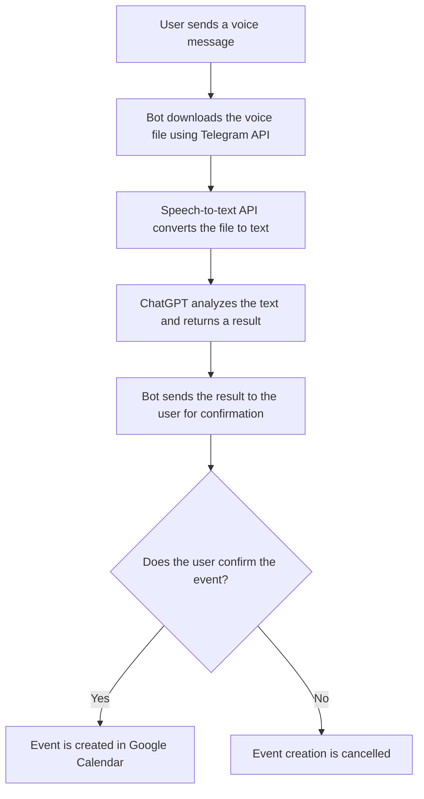

# Telegram bot Calendar

## Description

Telegram bot for creating events in Google calendar using text and audio messages. And also for searching for events and collecting analytics on them.

## Technologies
-  Google API
-  OpenAI API
-  JSON
-  Spring Core
-  Spring Data
-  PostgreSQL
-  AWS: EC2 + RDS
-  AssemblyAI API
-  Caffeine
-  Lombok
-  Maven
## How It Works

The bot follows these steps to process voice messages and create events in Google Calendar:

1. **Receiving a Voice Message**  
   The user sends a voice message to the Telegram bot.

2. **Downloading and Converting to Text**  
   The bot downloads the voice message using the Telegram API and sends it to a speech-to-text API (AssemblyAI). The result is a text transcription.

3. **Analyzing Text with ChatGPT**  
   The transcribed text is sent to the OpenAI API. ChatGPT analyzes the message, extracts the date, time, and event description, and returns the result.

4. **User Confirmation**  
   The bot sends the result to the user as a text message for confirmation. The user can either confirm or cancel.

5. **Creating an Event in Google Calendar**  
   After confirmation, the bot creates an event in Google Calendar using the Google Calendar API. The details are saved in the database for future use.

6. **Saving Data**  
   The bot saves authorization tokens and other user-specific data in the database to handle future requests.

### Workflow Diagram

## Getting Started
### Google Cloud Platform
- [Create a Google Cloud project](https://developers.google.com/workspace/guides/create-project)
- [Create access credentials](https://developers.google.com/workspace/guides/create-credentials)
    - Create an OAuth client ID: App Type Desktop
    - Download the json file
    - Rename the file to credentials.json
    - Copy the file to resources\config
- Remember to add your gmail in Test Users in your Project in Google Cloud Console
### Speech-to-Text Service
- Set up a speech-to-text service [AssemblyAI](https://www.assemblyai.com/)
    - Register for an account
    - Obtain an API key and save it securely
### OpenAI (ChatGPT Integration)
- Register at [OpenAI's website](https://openai.com/)
- Create an API key from the dashboard
- Save this key for later configuration
### Telegram
- Go to Telegram's BotFather
- Create a new bot
    - Run the command /newbot and follow the instructions
    - Save the Bot Token provided
### Set Up the Database
- Install a relational database system (PostgreSQL)
- Create a new table for the bot (user_data)

| Field Name    | Data Type     | Constraints         | Description                                                                 |
|---------------|---------------|---------------------|-----------------------------------------------------------------------------|
| `id`          | `BIGINT`      | `PRIMARY KEY`       | Unique identifier for the user.                                             |
| `user_id`     | `TEXT`        | `NOT NULL UNIQUE`   | Telegram user ID.                                                           |
| `version`     | `BIGINT`      | `SERIAL`            | Used for concurrency control.           |
| `access_token`| `TEXT`        |                     | Used to authenticate requests to the Google Calendar API.  |
| `refresh_token`| `TEXT`       |                     | Used to obtain a new access token when the current access token expires.  |
| `expiration_time_token`| `TEXT`|                     | The timestamp indicating when the access token will expire.  |
| `calendar`| `TEXT`        |                     | The identifier of the user's Google Calendar.  |
| `keywords`| `TEXT`        |                     | A list of keywords.  |
| `default_keyword`| `TEXT`        |                     | The default keyword.  |
| `compound_keywords`| `TEXT`        |                     | A list of compound keywords.  |

This step-by-step guide will help you set up the bot, integrate with required APIs, and prepare the database for full functionality.
